# Praktikum Komunikasi Data dan Jaringan Komputer Modul 5 - K06

## Anggota Kelompok
| NRP | Nama |
|---|---|
| 5027241006 | Nabilah Anindya Paramesti |
| 5027241041 | Raya Ahmad Syarif |

---

# Misi 1

## Topologi 

## Subnet

## Tree VLSM

## Pembagian IP - VLSM
Berikut adalah pembagian IP Address menggunakan metode VLSM (Variable Length Subnet Mask):  

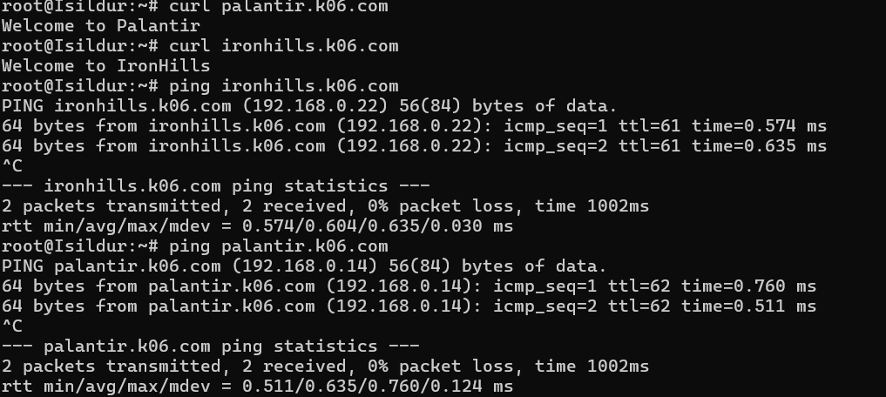
# Misi 2
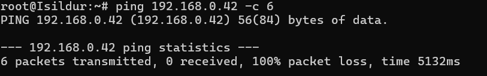

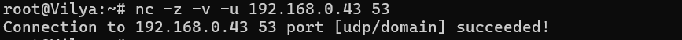

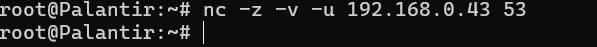

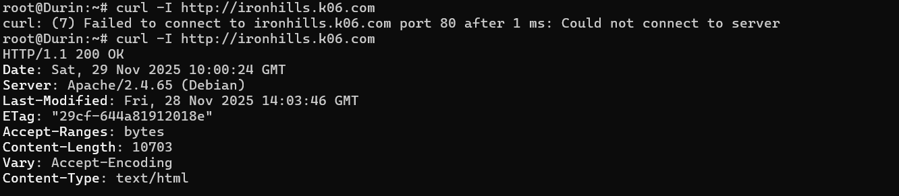

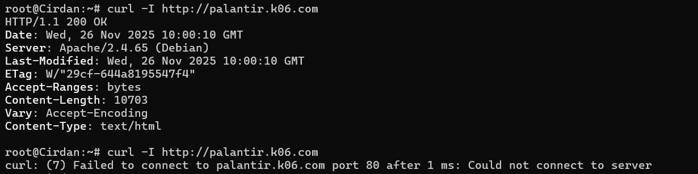

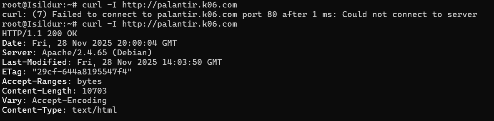

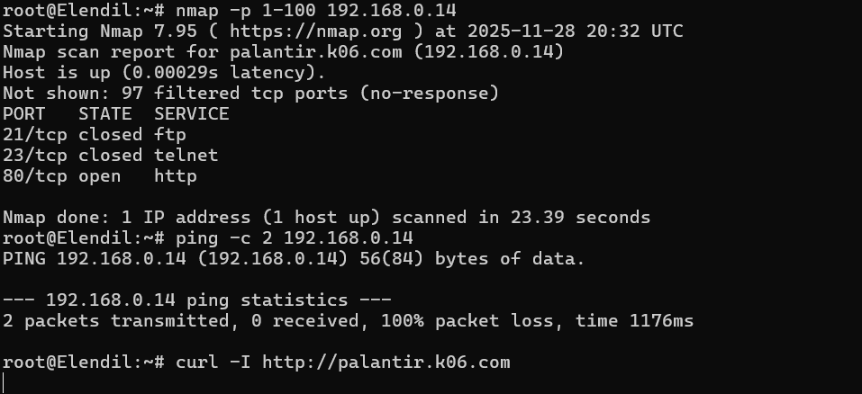

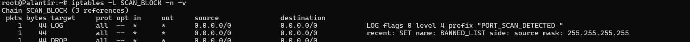

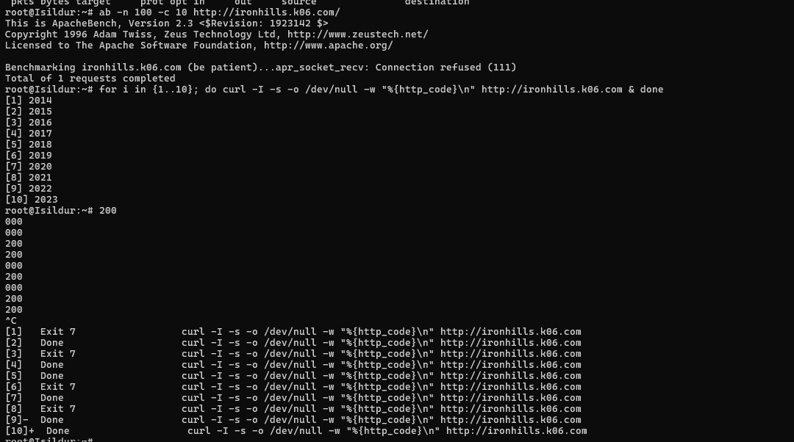

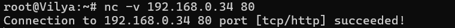

# Misi 3

Blokir semua lalu lintas masuk dan keluar dari Khamul.

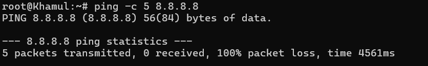

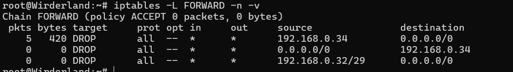
